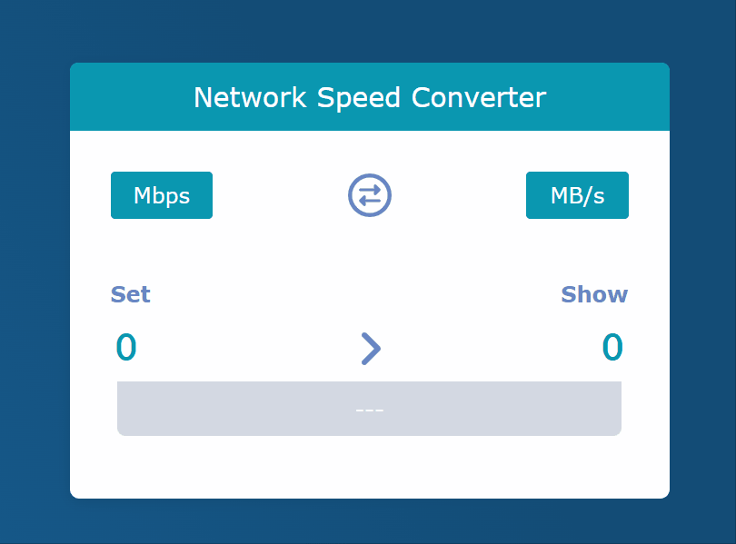

# 網速單位轉換器

主要根據 [從 Hooks 開始，讓你的網頁 React 起來](https://pjchender.dev/react-bootcamp/) Chapter 3 練習的 React 小專案。

## 專案練習內容

- 使用 Create React App 工具建立專案。

- React 元件表單的基本應用。

- React 元件的拆分。

- React 元件間的資料傳遞 (`props`)及修改。

- 使用 React FontAwesome。

## 專案 Demo

[💻Demo](https://ypinpin.github.io/internet-speed-converter/)

